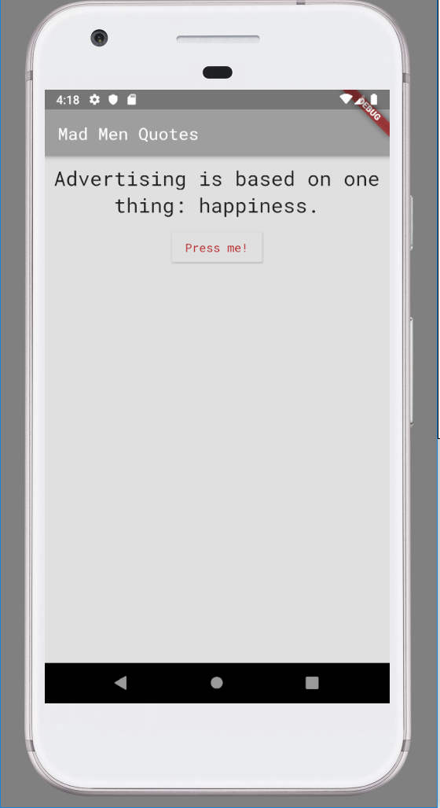
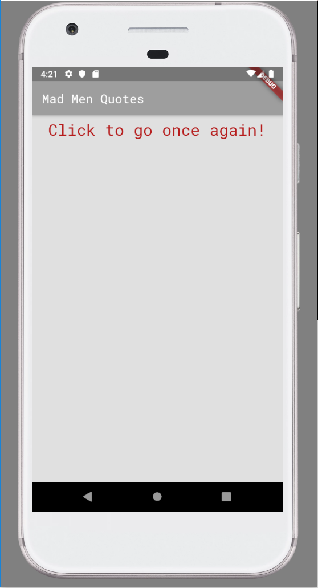

# First Flutter & Dart Course Assignment 'Mad Men Quotes'

First assignment for Flutter & Dart development course.
**Link:** https://www.udemy.com/course/learn-flutter-dart-to-build-ios-android-apps/.

## Brief Description

The assignment was for training basic Flutter and Dart syntax and rules. Directions were simple:
1. Create a new Flutter App (in this project) and output an AppBar and some text below it.
2. Add a button which changes the text (to any other text of your choice).
3. Split the app into three widgets: App, TextControl & Text

My app outputs random Mad Men Quote after clicking a button. You can also restart the app when you
run out of quotes. Even though it wasn't necessary I chose to add some 'extras' such as Google's
RobotMono font, background color, etc just for fun and training.

     
    

## Issues and further development

* Once a quote appears, it can appear again - need to fix that.
* Quotes should be centered - they are not for now.

